# Plan de Activación y Mantenimiento del Sniffer en Laboratorio Real

Este documento establece la hoja de ruta y la estrategia técnica para la prueba en vivo de mañana directamente en el laboratorio del cliente, asegurando la escalabilidad del sistema y la estabilidad de la base de datos a largo plazo.

---

## 📅 Roadmap de Trabajo para Mañana

```mermaid
gantt
    title Cronograma de Activación (Mañana)
    dateFormat  HH:mm
    axisFormat %H:%M
    section Conectividad
    1. Configuración de IPs & Puertos           :a1, 09:00, 10:00
    section Captura
    2. Intercepción y Parseo de Tramas          :a2, 10:00, 11:30
    section Lógica
    3. Clasificación (QC/Cal/Rep)               :a3, 11:30, 13:00
    section Optimización
    4. Plan de Mantenimiento de BD              :a4, 13:00, 14:00
    section Inventario
    5. Validación de Descuento en Vivo          :a5, 14:00, 15:30
```

---

## Detalle del Plan de Trabajo

### Paso 1: Configuración de IPs y Puertos (LAN)
* **Acción:** Recibiremos las 5 IPs estáticas reales de los analizadores.
* **Ajuste:** Actualizaremos el listener TCP del backend de desarrollo para abrir sockets dedicados en los puertos configurados en los equipos (generalmente puerto `5100` para ASTM o `5600` para HL7).
* **Validación:** Haremos un `ping` desde la laptop del LIMS hacia cada analizador para confirmar conectividad de red local.

### Paso 2: Validación y Parseo de Tramas ASTM/HL7
* **Acción:** Pondremos los analizadores a transmitir sus primeras pruebas.
* **Ajuste:** Capturaremos las tramas crudas en la consola del backend y ajustaremos las expresiones regulares del parser para extraer:
  - Código de la Prueba (ej: `GLU`, `TSH`, `WBC`).
  - ID de la Muestra / Paciente.
  - Resultado.

### Paso 3: Identificación y Clasificación de Variables
* **Acción:** Verificaremos la nomenclatura del laboratorio para:
  - **Calibraciones:** Identificar si usan prefijos como `CAL`, `STD`, o códigos del fabricante.
  - **Controles (QC):** Validar si se reportan como `QC1`, `L1`, `N`, `P` o `CTRL`.
  - **Repeticiones:** Confirmar que la regla de 10 minutos para duplicados capture la repetición del equipo.

---

## 🗄️ Paso 4: Plan de Mantenimiento de la Base de Datos (Evitar Bloat)

La tabla `log_sniffer` almacena la columna `raw_frame` como `VARCHAR(Max)` (texto largo). Si el laboratorio corre 500 pruebas al día, esta tabla acumulará miles de registros al mes, lo que puede ralentizar las consultas del Dashboard.

### 🛡️ Estrategia de Purga y Archivado Automático:

Implementaremos un **Job de Mantenimiento Automático** en el backend que corra cada noche a las 11:59 PM:

1. **Retención Corta de Tramas Crudas (30 días):**
   - El texto gigante de la trama cruda (`raw_frame`) solo se necesita para auditoría inmediata. Transcurridos 30 días, el Job ejecutará un script SQL para **limpiar/vaciar el campo `raw_frame`** de los registros antiguos (dejándolo en `NULL` o vaciando el texto), pero manteniendo la fila con la fecha, el equipo, el tipo de corrida y el volumen descontado para no perder las estadísticas históricas.
2. **Archivado Histórico (Opcional):**
   - Si el laboratorio exige conservar las tramas crudas por meses, en lugar de guardarlas en la base de datos transaccional, las exportaremos automáticamente a archivos de texto planos agrupados por mes (ej. `logs_sniffer_julio_2026.txt`) en el disco duro de la laptop, liberando espacio en SQL Server.

---

### Paso 5: Descuento Directo y Cierre
* **Acción:** Ejecutaremos pruebas de control reales en los equipos y cruzaremos la información con los reactivos físicos.
* **Validación:** Validaremos que el stock en ml en la pantalla de inventario baje en tiempo real según el factor de conversión por prueba configurado.

---

## 🚀 Conclusión

Esta visión es sólida, estructurada y ataca los problemas reales que ocurren en un laboratorio (conectividad, diferencias en tramas y crecimiento desmedido de la base de datos). Mañana ejecutaremos esta hoja de ruta paso a paso. ¡Estamos listos!
