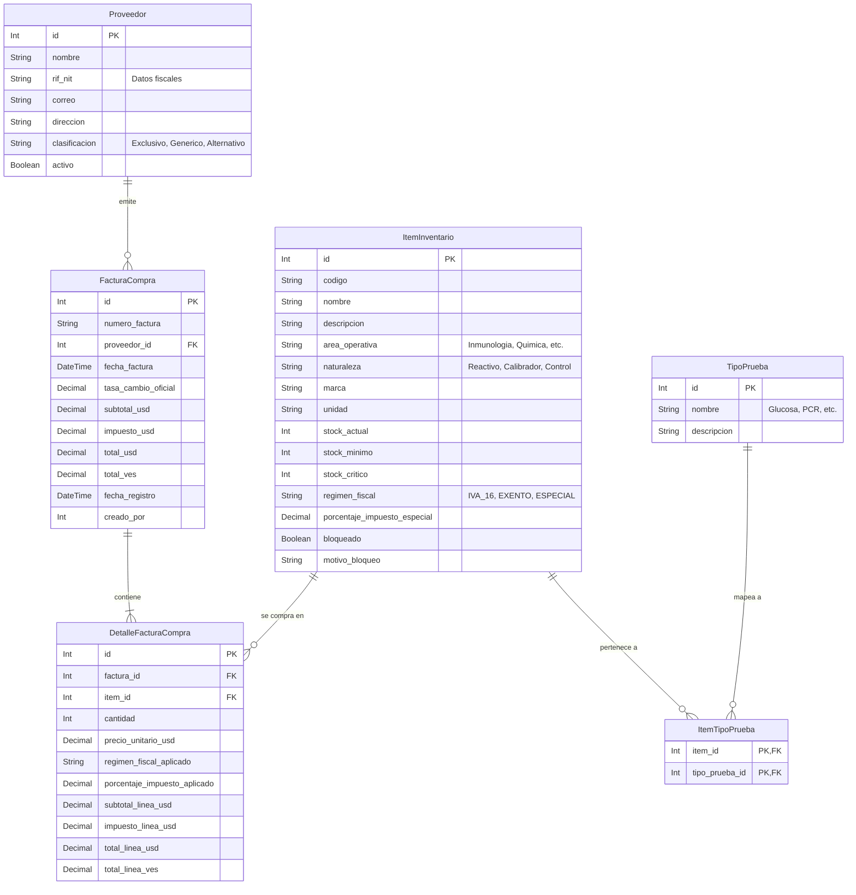

# Reporte de Viabilidad: Gestión de Inventario y Análisis Financiero para Controlab-IA

Este documento evalúa la viabilidad técnica y arquitectónica para incorporar el módulo de **Gestión de Inventario y Análisis Financiero** en la estructura actual del proyecto `Controlab-IA`. El análisis se presenta bajo la perspectiva de un Arquitecto de Software Senior y Consultor de IA, asegurando la cohesión con la arquitectura limpia/modular (Screaming Architecture) y la base de datos SQL Server mediante Prisma ORM instalados en fases previas.

---

## 1. Veredicto de Viabilidad

El módulo propuesto es **100% viable** de implementar sobre la base de código actual. La coexistencia del backend modularizado en Node.js (con Express y Prisma Client) y el frontend estructurado en React.js con Material UI ofrece el entorno ideal para esta integración. 

### Factores Clave de Éxito:
*   **Base de datos relacional:** La base actual en Microsoft SQL Server soporta perfectamente las relaciones complejas requeridas (muchos-a-muchos para mapeos, historial de tasas de cambio y detalles de facturas con precisión decimal).
*   **Arquitectura Modular ("Screaming Architecture"):** Al haber separado el inventario en un módulo independiente (`src/modules/inventory`), la adición de compras (`src/modules/purchases`), proveedores (`src/modules/suppliers`) y la extensión de reportes (`src/modules/reports`) se puede realizar de forma aislada sin riesgo de regresión sobre la lógica actual.
*   **Librerías ya instaladas:** Contamos con `xlsx` y `exceljs` en el backend para la generación de reportes estratégicos estructurados y descargas directas.

---

## 2. Impacto en el Modelo de Datos (SQL Server & Prisma)

Para soportar los nuevos requerimientos (gestión fiscal, múltiples monedas, marcas, vinculación a pruebas genéricas, control de proveedores y bloqueo de productos), proponemos extender la base de datos con el siguiente esquema relacional:

### Esquema Físico y Relaciones Propuestas



### Justificación de Cambios en la BD:
1.  **Precisión Decimal:** Todos los campos financieros (`precio_costo`, `precio_unitario_usd`, `tasa_cambio`, `subtotal`, `impuestos`, etc.) se definirán en SQL Server con el tipo `Decimal(18, 4)` o `Decimal(10, 4)` para evitar errores de redondeo de punto flotante en cálculos de impuestos cruzados.
2.  **Relación Muchos-a-Muchos (`ItemTipoPrueba`):** Permite asociar diferentes marcas/SKUs a una sola prueba. Por ejemplo, `Glucosa G6` (marca X) y `Glucosa Bioclean` (marca Y) apuntarán al mismo `TipoPrueba` ("Glucosa").
3.  **Trazabilidad Cambiaria:** Al almacenar la `tasa_cambio_oficial` en la cabecera de la factura y calcular el equivalente en VES por línea al momento del registro, se blinda el histórico contra fluctuaciones futuras de la divisa, permitiendo reportar costos retroactivos con precisión absoluta.

---

## 3. Lógica Financiera y de Impuestos (Backend)

El backend resolverá las transacciones siguiendo estas directrices matemáticas:

### Algoritmo de Registro de Compras:
Cuando el usuario registra una compra en el endpoint `POST /api/purchases`:
1.  **Captura de Tasa de Cambio:** Se registra la tasa de cambio oficial indicada para la fecha de la factura ($TC$).
2.  **Por línea de producto:**
    *   Determinar el precio base unitario en USD ($P_{USD}$).
    *   Obtener la configuración fiscal del `ItemInventario`:
        *   **Sujeto a IVA:** Impuesto = $P_{USD} \times 0.16$.
        *   **Exonerado:** Impuesto = 0.
        *   **Especial/Diferenciado:** Impuesto = $P_{USD} \times (\%ImpuestoEspecial / 100)$.
    *   Calcular montos de línea:
        *   $Subtotal_{USD} = Cantidad \times P_{USD}$
        *   $Impuesto_{USD} = Cantidad \times Impuesto_{Unitario\_USD}$
        *   $Total_{USD} = Subtotal_{USD} + Impuesto_{USD}$
        *   $Total_{VES} = Total_{USD} \times TC$ (Monto en Bolívares calculado simultáneamente).
3.  **Actualización de Inventario y Precios:**
    *   Incremento del `stock_actual` en `ItemInventario`.
    *   Registro del movimiento en `movimientos_inventario` con el tipo `ENTRADA` y referencia al ID de factura de compra.
    *   Actualización del `precio_costo` del producto con el valor unitario de la última compra.
4.  **Historial de Precios:** La tabla `DetalleFacturaCompra` servirá de forma nativa como el historial cronológico para el cálculo de variaciones de precios (Última Compra vs Anterior).

---

## 4. Estructura de la API (Screaming Architecture)

Siguiendo el patrón implementado en la Fase 3, el backend se extenderá estructurándose bajo dos nuevos módulos limpios:

### 1. Módulo de Compras (`src/modules/purchases/`)
*   `purchases.routes.js`: Rutas públicas/privadas (`GET /`, `GET /:id`, `POST /`, `PUT /:id/cancel`).
*   `purchases.controller.js`: Sanitización de entradas, captura del usuario firmante, y envío de respuestas.
*   `purchases.service.js`: Lógica de negocio (conversión cambiaria de USD a VES, aplicación de tasas impositivas variables, lógica FIFO si aplica).
*   `purchases.repository.js`: Transacciones atómicas de Prisma para insertar facturas, insertar detalles, registrar movimientos de almacén e incrementar el stock.

### 2. Módulo de Proveedores (`src/modules/suppliers/`)
*   Permite abastacer la configuración requerida: clasificación del proveedor (Exclusivo, Genérico, Alternativo), RIF y correos oficiales para validación y alertas.

### 3. Módulo de Reportes (`src/modules/reports/`)
*   Se encargará de las queries complejas de agregación, unificando el consumo por tipo de prueba genérica y calculando el impacto de la tasa de cambio.

---

## 5. Diseño del Dashboard de Filtros Cruzados (Frontend)

El frontend contará con un panel analítico multidimensional interactivo. 

### Componentes UI Propuestos (Material UI & Chart.js):
1.  **Panel de Filtros Avanzados (Sidebar o Header Colapsable):**
    *   *Selectores Múltiples:* Naturaleza (Reactivo/Calibrador/Control), Área Operativa (Inmunología/Química), Régimen Fiscal, Clasificación del Proveedor.
    *   *Buscador:* Autocompletado para marcas específicas y tipos de prueba genérica.
    *   *Selector de Rango de Fechas:* Con preajustes (Este mes, Último trimestre, Año fiscal).
2.  **Métricas Clave (KPI Cards):**
    *   Gasto Total en USD (con desglose de impuestos y neto).
    *   Gasto Equivalente en VES.
    *   Porcentaje de variación de precio promedio vs periodo anterior.
    *   Indicador visual de alertas activas (Riesgo Stock Out / Próximos a vencer).
3.  **Gráficos Dinámicos:**
    *   *Gráfico de Barras:* Consumo mensual por Área y Naturaleza.
    *   *Gráfico de Torta / Donut:* Distribución del gasto por marcas o por clasificación de proveedores.
4.  **Tabla de Comparativa de Precios:**
    *   Visualiza productos similares (misma prueba genérica) y compara el precio unitario del proveedor A (exclusivo) vs el proveedor B (alternativo) para facilitar decisiones de compra informadas.

---

## 6. Motor de Reportes y Exportación

### Sumatoria por Prueba Genérica:
Para el reporte agregado solicitado, el backend ejecutará una agrupación SQL que une los detalles de importación de pruebas o consumos, resolviendo la marca a través de la relación de mapeo:
```sql
SELECT 
    tp.nombre AS PruebaGenerica,
    ii.marca AS Marca,
    SUM(dc.cantidad) AS CantidadConsumida,
    SUM(dc.total_linea_usd) AS CostoTotalUSD
FROM DetalleFacturaCompra dc
INNER JOIN items_inventario ii ON dc.item_id = ii.id
INNER JOIN ItemTipoPrueba itp ON ii.id = itp.item_id
INNER JOIN TipoPrueba tp ON itp.tipo_prueba_id = tp.id
GROUP BY ROLLUP (tp.nombre, ii.marca)
```
Esto permite obtener simultáneamente el consumo detallado por marca individual y los subtotales agregados por tipo de prueba genérica.

### Exportación a Excel (.xlsx):
El endpoint `GET /api/reports/export-excel/financial` procesará el listado resultante y generará un archivo Excel formateado utilizando la librería `xlsx`, con las siguientes columnas requeridas:
*   `Código` | `Nombre` | `Área` | `Naturaleza` | `Marca` | `Régimen Fiscal` | `Stock` | `Vencimiento` | `Último Precio Unitario (USD)` | `Último Precio Total con Impuestos (USD)` | `Último Precio Total con Impuestos (VES)` | `Tasa de Cambio Aplicada`

---

## 7. Conclusión del Análisis

El módulo es **totalmente viable**. Su implementación no requiere modificaciones estructurales invasivas, sino una extensión planificada y ordenada sobre las bases que ya posee el proyecto:
1.  **Base de datos:** Adición de 4 tablas (`Proveedor`, `TipoPrueba`, `FacturaCompra`, `DetalleFacturaCompra`) y actualización de `ItemInventario`.
2.  **Backend:** Creación de controladores y repositorios Prisma bajo la estructura de módulos limpia ya validada en Fase 3 y 4.
3.  **Frontend:** Reutilización de los skeletons de la carpeta `/pages/Compras` y `/pages/Reports`, poblándolos con las llamadas correctas a las nuevas APIs y agregando controles MUI para el filtrado dinámico.
