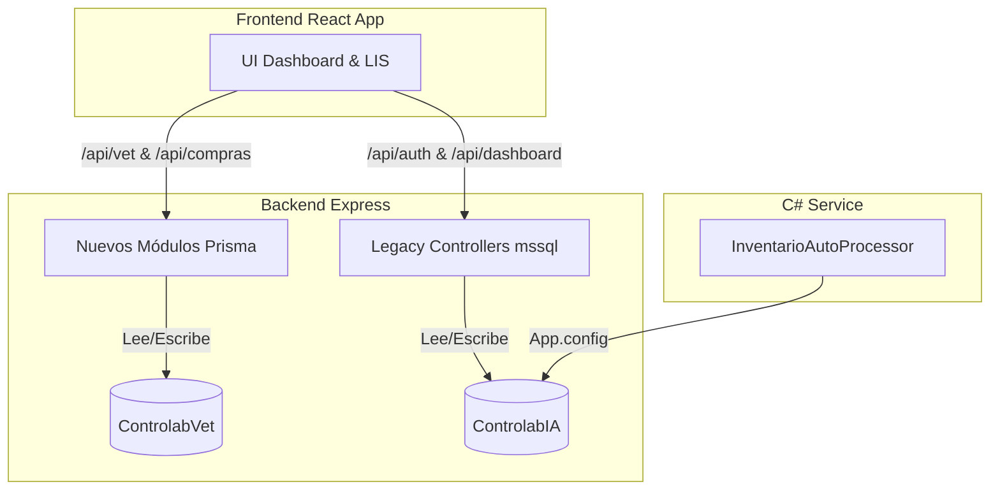

# Informe de Auditoría Técnica: Consistencia de Arquitectura y Software - Controlab VET

**Preparado por:** Arquitecto de Software Senior  
**Fecha:** 2026-06-23  
**Estado:** CONFIDENCIAL / AUDITORÍA INTERNA

---

## 1. Resumen Ejecutivo
Tras una revisión exhaustiva del repositorio de **Controlab VET** (código frontend, backend y el servicio de procesamiento en background en C#), se presentan los hallazgos críticos de consistencia técnica. 

El software se encuentra en un **estado de transición arquitectónica**, coexistiendo código heredado (Legacy monolítico) con nuevos dominios modulares. El hallazgo más crítico es una **inconsistencia de datos estructural por división de bases de datos**, acompañado de **vulnerabilidades de seguridad severas** en el flujo de autenticación.

---

## 2. Consistencia de Base de Datos y Persistencia (Hallazgo Crítico)

### 2.1 El Problema de la "Base de Datos Dividida" (Split Database)
El sistema sufre de una descoordinación de persistencia de datos. Existen dos bases de datos físicas en el mismo servidor: `ControlabIA` y `ControlabVet`. El backend está configurado de forma inconsistente respecto a cuál de las dos usar:

1. **Persistencia mediante Prisma (Módulos Nuevos - LIS/Compras/Costos):**
   - Configurado en el archivo `backend/.env` usando `DATABASE_URL`.
   - Apunta a: **`ControlabVet`**.
   - Tabla afectada: Exámenes LIS, animales, razas, propietarios, compras y configuraciones de costos.
2. **Persistencia mediante `mssql` Client (Legacy/Auth/Dashboard/Movimientos):**
   - Configurado en `backend/config/db.js` y `authController.js` (con valores por defecto hardcodeados).
   - Apunta a: **`ControlabIA`** (ya que la variable de entorno `DB_DATABASE` no está definida en el `.env`).
   - Tabla afectada: Autenticación de usuarios (`usuarios`), métricas de inventario del dashboard (`items_inventario`), lotes de reactivos y bitácoras de consumo.



### 2.2 Impacto Comercial y Operativo
- **Desincronización del Inventario:** Si un usuario agrega reactivos o insumos en la nueva pantalla de inventario, se guardan en `ControlabVet`. Sin embargo, al abrir el **Dashboard**, las métricas de stock y alertas críticas se consultan de `ControlabIA`, resultando en un panel con información desfasada o vacía.
- **Inconsistencia de Usuarios:** Un usuario registrado en la base de datos de LIS (`ControlabVet`) no podrá iniciar sesión si sus credenciales no se replican manualmente en la tabla `usuarios` de `ControlabIA`.

---

## 3. Seguridad y Criptografía (Vulnerabilidades Críticas)

### 3.1 Almacenamiento de Contraseñas en Texto Plano
En `backend/controllers/authController.js` (Línea 39):
```javascript
if (contraseña !== user.contraseña) { ... }
```
- **Fallo:** Las contraseñas se almacenan y comparan directamente como texto plano. No se utiliza ningún algoritmo de hash adaptativo (como `bcrypt` o `argon2`). 
- **Riesgo:** Si un tercero obtiene acceso de lectura a la base de datos (por SQL Injection o robo de respaldos), tendrá acceso inmediato a las credenciales de todos los usuarios del sistema.

### 3.2 Firma de JWT Insegura
En `backend/controllers/authController.js` (Línea 46):
```javascript
const token = jwt.sign(
  { id: user.id, usuario: user.usuario, rol: user.rol },
  'mi_secreto_temporal'
);
```
- **Fallo:** La clave de firma del Token JWT está escrita directamente en el código fuente (`'mi_secreto_temporal'`) en lugar de cargarse dinámicamente desde variables de entorno. Cualquiera con acceso al código puede suplantar tokens y saltarse la seguridad.

---

## 4. Coherencia Arquitectónica del Backend

El backend se encuentra dividido en dos filosofías de diseño incompatibles:

| Característica | Módulos Nuevos (Screaming Architecture) | Legacy Controllers (Root MVC) |
| :--- | :--- | :--- |
| **Ubicación** | `src/modules/{feature}/` | `controllers/`, `routes/`, `services/` |
| **Patrón de Acceso** | Prisma ORM (relacional y seguro) | Consultas raw SQL directas mediante `mssql` |
| **Manejo de Transacciones** | Controlado por Prisma `$transaction` | No implementado o controlado manualmente por callbacks |
| **Validaciones** | Encapsuladas en servicios | Dispersas en el código de rutas o controladores |

---

## 5. Auditoría del Procesador en C# (`InventarioAutoProcessor`)

### 5.1 Acoplamiento e Inflexibilidad
El procesador en background cumple su rol de parsear archivos Excel y PDF, pero arrastra deuda técnica:
- **Violación del Single Responsibility Principle (SRP):** La clase principal `FileProcessor.cs` coordina el monitoreo de archivos, parsea las celdas de Excel, interpreta el texto del PDF, maneja el log y escribe en base de datos. Si el formato de un PDF cambia, hay que alterar y recompilar toda la lógica del procesador.
- **Configuración Rígida:** Conectado directamente a `ControlabIA` mediante `App.config`, ignorando la base de datos LIS de control veterinario (`ControlabVet`).

---

## 6. Recomendaciones de Mitigación (Plan de Saneamiento)

Para asegurar la **consistencia**, **estabilidad** y **seguridad** del producto antes del despliegue masivo en clientes, se deben ejecutar los siguientes pasos de saneamiento prioritarios:

1. **Unificación de Base de Datos (Fase 1 - Inmediato):**
   - Configurar las variables de entorno de base de datos en el backend de forma que tanto Prisma como el pool de `mssql` (`config/db.js`) apunten a **una sola base de datos unificada** (`ControlabVet`).
   - Apuntar el `App.config` del servicio C# `InventarioAutoProcessor` a la misma base de datos.
2. **Criptografía de Contraseñas (Fase 2 - Seguridad):**
   - Implementar `bcryptjs` en `authController.js` para encriptar contraseñas al crearse el usuario y compararlas con hash al autenticarse.
   - Migrar la firma de JWT a `process.env.JWT_SECRET`.
3. **Conclusión de la Refactorización Arquitectónica:**
   - Mover gradualmente los controladores y rutas legacy de la raíz hacia `src/modules/` para mantener una única estructura de proyecto limpia.
