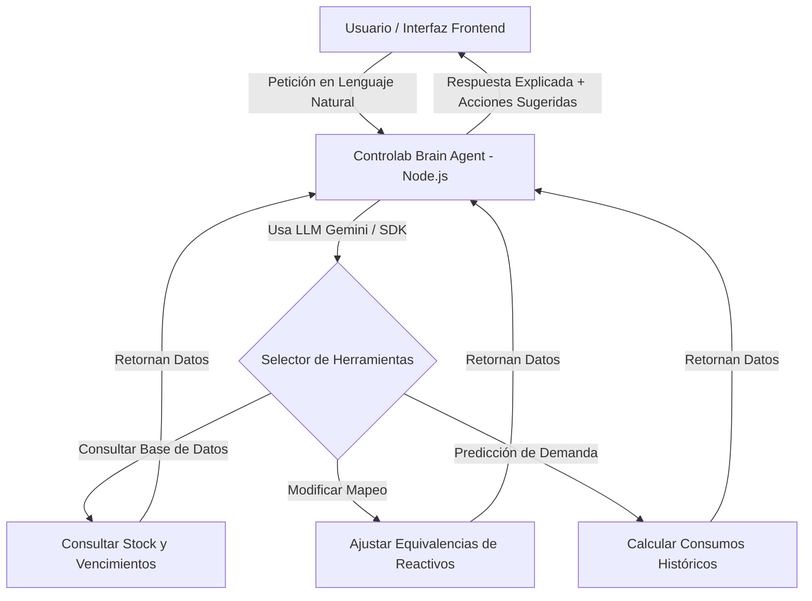

# Propuesta de Arquitectura: Cerebro Agente de IA para Controlab

Esta propuesta describe cómo integrar un **Agente de IA Autónomo ("Controlab Brain Agent")** que no solo responda preguntas en lenguaje natural, sino que interactúe dinámicamente con la base de datos de reactivos, consumos e inventario, aprendiendo y autoalimentándose del flujo de trabajo real en el laboratorio.

---

## 1. Arquitectura General del Agente

El agente funcionará bajo un patrón de **Herramientas (Tool Calling)**, lo que le permite decidir autónomamente qué consultas SQL o cálculos matemáticos realizar para resolver una inquietud o ejecutar una optimización.

---

## 2. Características Diferenciadoras (El Factor Inteligente)

### A. Autoalimentación y Autoajuste de Mapeo (Learning Loop)
* **El Problema:** El mapa de equivalencia dice que 1 prueba de Hemoglobina gasta exactamente `0.05 ml` de reactivo, pero en la práctica hay pérdidas por calibración del equipo, burbujas o descartes.
* **La Solución (Autoalimentación):** El agente compara la cantidad teórica descontada en el mes contra el stock real remanente reportado en los conteos físicos. Si encuentra una desviación constante (ej: un 5% de consumo extra), el agente propone ajustar la tasa de equivalencia teórica (ej: actualizar de `0.05 ml` a `0.0525 ml`) para que los descuentos automáticos futuros sean exactos.

### B. Notificaciones de Abastecimiento Predictivo (Predictive Stock Alert)
* Basándose en la velocidad de consumo (pruebas procesadas por día) y los lotes activos, el agente proyecta la fecha en la que un reactivo entrará en zona crítica.
* **Acción Diferenciadora:** El agente genera automáticamente un borrador de correo con el pedido específico de compra para el proveedor correspondiente, listo para que el usuario presione "Enviar".

### C. Chatbot Conversacional de Operaciones
* Una sección lateral donde el laboratorista puede preguntar de forma directa:
  * *“¿Para cuántas determinaciones de perfil lipídico me alcanza el lote actual?”*
  * *“¿Cuáles son los 3 reactivos que debo priorizar gastar esta semana por vencimiento?”*

### D. Estructura de Costos y Configuración Fiscal (Análisis Financiero Integrado)
El agente tendrá acceso completo al módulo de compras, tasas de cambio e impuestos para responder y optimizar financieramente:
* **Configuración Fiscal:** Análisis de productos con regímenes de IVA (16%), Exentos o Impuestos Especiales.
* **Cálculo de Moneda Dual (USD / VES):** Conversión automática a Dólares (moneda base de referencia) y Bolívares usando la tasa de cambio oficial del día de facturación.
* **Agrupación por Tipo de Prueba (Relación Muchos a Muchos):** El agente consolida los datos de consumo agregando múltiples marcas comerciales asociadas a una misma prueba genérica (ej: Glucosa).
* **Análisis de Márgenes e Impacto Cambiario:** Evalúa cómo afecta la variación de la tasa de cambio y la variación de precios de proveedores en la estructura de costos del laboratorio.

---

## 3. Hoja de Ruta Sugerida para la Implementación

1. **Fase 1 (Cimientos del Agente en Backend y Estructura Financiera):**
   * Crear el nuevo servicio `backend/services/agentService.js` integrado con la API de Gemini.
   * Definir las herramientas financieras para el agente: `obtener_estructura_costos()`, `obtener_variacion_precios_proveedor()`, `obtener_historico_tasas()`.
   * Integrar la lógica para registrar facturas con tasa cambiaria e impuestos variables (16%, exento, especial).

2. **Fase 2 (Interfaz de Usuario en Frontend):**
   * Crear un componente flotante de chat o asistente en la barra de navegación de Controlab.
   * Diseñar el Dashboard con filtros cruzados (Área + Naturaleza + Marca + Régimen Fiscal + Rango de Fechas).

3. **Fase 3 (Algoritmos de Autoalimentación y Predicción):**
   * Programar procesos de análisis automatizados que comparen márgenes, sugieran el cambio de marcas menos rentables y proyecten el impacto cambiario.

---

> [!NOTE]
> Esta arquitectura está diseñada para integrarse de forma modular sin alterar el funcionamiento actual de `server-minimo.js`. Se creará como servicios independientes en la carpeta `/services/` y `/routes/`.
