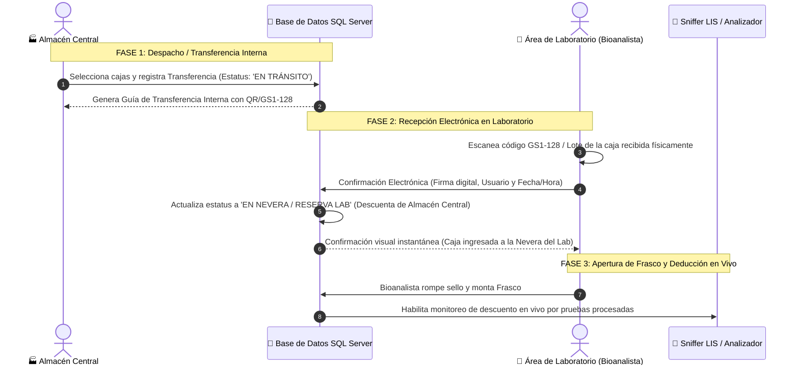

# Plan de Implementación: Flujo de Recepción Electrónica de Cajas (Almacén ↔ Laboratorio)

Este documento describe la arquitectura y el plan de flujo de trabajo para la **Recepción Electrónica de Cajas de Reactivos** entre el **Área de Almacén Central** y las **Áreas de Laboratorio** (Química Clínica, Hematología, Quimioluminiscencia, etc.), permitiendo la confirmación digital inmediata mediante escáner láser GS1-128 o código de lote.

---

## 👥 Áreas Involucradas y Flujo Operativo Completo

---

## 📋 Pasos Detallados del Flujo Electrónico

### 1. 🏭 Fase Almacén Central (Despacho Electrónico)
* **Ingreso Inicial de Compras:** El Almacén Central recibe las cajas de reactivos del proveedor con su lote, fecha de vencimiento, número de frascos y contenido por frasco.
* **Solicitud o Despacho a Laboratorio:** Almacén selecciona las cajas destinadas a una sección específica (ej. *Química Clínica* o *Hematología*).
* **Emisión de Transferencia (`EN_TRANSITO`):** Almacén confirma el envío. La caja cambia su estatus en el sistema a `EN_TRANSITO_LAB` y se descuenta del disponible de venta/despacho general de Almacén Central, quedando "consignada" en camino al laboratorio.

---

### 2. 🔬 Fase Laboratorio (Confirmación Electrónica en Recepción)
* **Llegada Física:** La caja física llega a la puerta o nevera del área de Laboratorio.
* **Escaneo de Confirmación Digital:** El bioanalista o recepcionista de laboratorio escanea el código de barras (GS1-128 o código de lote) directamente en la pantalla de **Recepción Electrónica de Laboratorio**.
* **Verificación Automática:** El sistema valida:
  1. Que la caja efectivamente estaba en tránsito hacia esa área.
  2. Que la fecha de vencimiento y lote coincidan exactamente con la orden de traslado.
* **Confirmación Digital Instantánea:**
  * La caja pasa a estatus `EN_NEVERA_LABORATORIO` (Caja Cerrada en Reserva).
  * Se registra en el Kárdex de Trazabilidad el **Usuario receptor, la hora exacta y la IP del terminal**.
  * Se emite una alerta verde en pantalla confirmando el ingreso a la nevera del laboratorio.

---

### 3. 🧪 Fase Montaje y Conexión con Sniffer (Uso Operativo)
* **Apertura de Frasco:** Cuando el analizador (*CM 260i*, *Mindray BS-230*, etc.) requiere reactivo, el bioanalista toma la caja de la nevera, abre el **Frasco #1** y lo escanea o selecciona en el monitor.
* **Conexión LIS/Sniffer:** La caja cambia a estatus `EN_ANALIZADOR` (En Uso) y el Sniffer descuenta automáticamente cada test procesado en tiempo real.

---

## 🗄️ Ajustes de Base de Datos Propuestos

#### [MODIFY] [schema.prisma](file:///c:/controlab-desa/backend/prisma/schema.prisma)
#### [MODIFY] [LotesReactivos](file:///c:/controlab-desa/backend/prisma/schema.prisma#L203)

Se agregarán los siguientes campos a la tabla `LotesReactivos` para soportar la trazabilidad completa entre almacén y laboratorio:

* `almacen_origen_id` (INT): Identificador del Almacén Central emisor.
* `almacen_destino_id` (INT): Identificador del Almacén o Área de Laboratorio receptora.
* `estado_transferencia` (NVARCHAR(50)): `'ALMACEN_CENTRAL'`, `'EN_TRANSITO'`, `'RECIBIDO_LABORATORIO'`, `'EN_ANALIZADOR'`, `'AGOTADO'`.
* `usuario_despacho` (NVARCHAR(100)): Usuario de Almacén que autorizó la salida.
* `usuario_recepcion` (NVARCHAR(100)): Bioanalista/Usuario que escaneó la confirmación electrónica en el laboratorio.
* `fecha_despacho` (DATETIME): Fecha y hora exacta de salida de Almacén.
* `fecha_recepcion_lab` (DATETIME): Fecha y hora exacta del escaneo de recepción en Laboratorio.

---

## 🖥️ Cambios Propuestos en la Interfaz (Frontend React)

#### [MODIFY] [WarehousesHub.js](file:///c:/controlab-desa/frontend/src/features/inventory/pages/WarehousesHub.js) (Módulo Almacén Central)
* **Pestaña "Despacho a Laboratorio":** Permite al personal de almacén seleccionar cajas por reactivo y enviarlas a un laboratorio específico, marcándolas en tránsito.

#### [MODIFY] [GestionCajasFrascos.jsx](file:///c:/controlab-desa/frontend/src/pages/CajasFrascos/GestionCajasFrascos.jsx) (Módulo Recepción Laboratorio)
* **Banner de Recepción Electrónica Directa:** Cuadro de escaneo continuo con la pistola láser.
* **Sección "Cajas en Tránsito por Confirmar":** Lista visual de cajas que vienen en camino de Almacén Central. Al escanear el código, la caja se confirma automáticamente sin necesidad de usar el mouse.
* **Pestaña "Nevera / Reserva":** Muestra todas las cajas confirmadas electrónicamente que están dentro de la nevera del laboratorio listas para ser abiertas.

---

## ❓ Open Questions para Revisión

> [!IMPORTANT]
> 1. **Diferencias en Escaneo:** ¿Al recibir la caja en el laboratorio se escaneará siempre con la **pistola láser de código de barras (GS1-128)** o deseas que también exista un botón de **"Confirmar Recepción Manual"** con un clic por si la pistola no está disponible en ese momento?
> 2. **Devoluciones:** Si el laboratorio recibe por error una caja que no solicitó, ¿requieres la opción de **"Rechazar / Devolver a Almacén Central"** desde la misma pantalla electrónica?

---

## 🧪 Plan de Verificación

### Pruebas de Flujo con Data Real:
1. **Verificación de Despacho:** Crear una orden de transferencia de 1 caja del reactivo de *Colesterol* (`REA-BQ-CHOL-CM`) desde Almacén Central hacia el área de Química.
2. **Verificación de Escaneo:** Escanear el código de lote `LDK1027060` en la pantalla de Recepción de Laboratorio y validar que cambie a `RECIBIDO_LABORATORIO` con fecha y usuario.
3. **Verificación de Kárdex:** Confirmar que en la tabla `movimientos_inventario` se registre el movimiento tipo `TRANSFERENCIA_COMPLETADA` relacionando a ambos almacenes.
