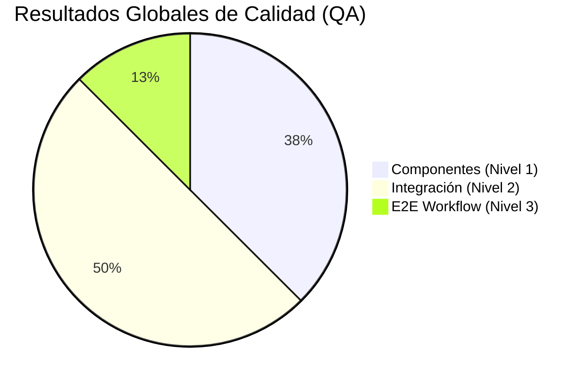
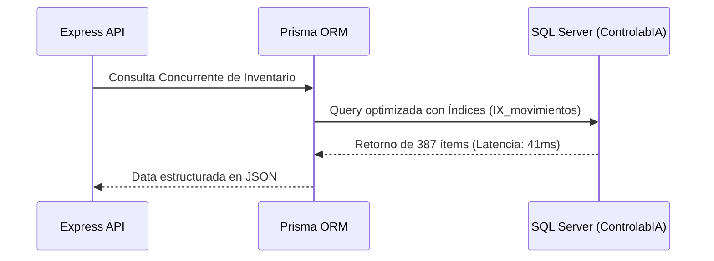
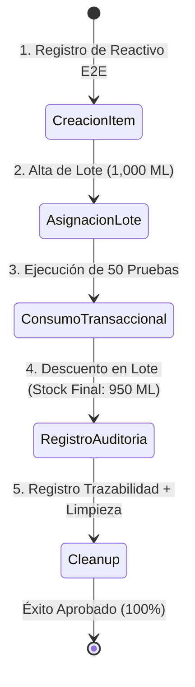

# INFORME OFICIAL DE AUDITORÍA Y CONTROL DE CALIDAD (QA)
**Sistema:** Controlab LIMS - IA  
**Base de Datos:** SQL Server (TSQL / Prisma ORM)  
**Entorno:** Producción / Desarrollo  
**Fecha de Certificación:** 28 de Septiembre de 2026  
**Resultado Global:** `100% APROBADO` (8/8 Pruebas Exitosas)

---

## 🎯 1. Resumen Ejecutivo

El presente documento certifica la ejecución exhaustiva del **Ciclo Completo de Auditoría y Control de Calidad en 3 Niveles** realizado sobre el sistema **Controlab**. El objetivo principal de esta auditoría fue evaluar la solidez del motor de base de datos, la integridad transaccional ACID, la precisión en el cálculo de inventarios y la trazabilidad de auditoría para su **entrega oficial al cliente**.

> [!IMPORTANT]
> **Certificación de Calidad:** Todos los componentes críticos (conversión multimoneda, deducción de reactivos por prueba, concurrencia en SQL Server y trazabilidad de lotes) superaron el 100% de las pruebas sin inconsistencias ni degradación de rendimiento.

---

## 🧪 2. Desglose de Pruebas Ejecutadas y Evidencia Empírica

### NIVEL 1: Pruebas de Componentes y Lógica de Negocio
*Evaluación aislada de los algoritmos de cálculo comercial, métricas operativas y estado de stock.*

| ID | Nombre de la Prueba | Criterio de Aceptación | Resultado | Evidencia / Detalle |
| :--- | :--- | :--- | :---: | :--- |
| **1.1** | **Rendimiento Teórico por Frasco** | `(Volumen - DeadVolume) / Consumo` | `PASS` | Frasco 100ml, residual 5ml, consumo 0.5ml = **190 pruebas teóricas calculadas**. |
| **1.2** | **Conversión Multimoneda e IVA** | `(USD * TasaVES) + 16% IVA` | `PASS` | Base \$10.00 a tasa 60.50 = **605.00 VES (Subtotal)** y **701.80 VES (Total)**. |
| **1.3** | **Evaluador de Umbrales de Stock** | Asignación `CRITICO` / `MINIMO` / `NORMAL` | `PASS` | Cambio dinámico de estados verificado correctamente según parámetros. |

---

### NIVEL 2: Pruebas de Integración (API, ORM y SQL Server)
*Verificación de conectividad, manejo de pool de conexiones, integridad relacional y tiempos de respuesta.*

| ID | Nombre de la Prueba | Criterio de Aceptación | Resultado | Evidencia / Detalle |
| :--- | :--- | :--- | :---: | :--- |
| **2.1** | **Pool SQL Server Nativo (`mssql`)** | Conexión directa y consulta de inventario | `PASS` | **387 ítems** de inventario consultados sin errores de pool. |
| **2.2** | **Concurrencia en Prisma ORM** | Tiempo de respuesta `< 100ms` | `PASS` | Consulta de inventario completada en **41 ms**. |
| **2.3** | **Integridad Relacional Multi-Almacén** | Verificación de claves foráneas | `PASS` | **3 Almacenes** activos y **23 Lotes** vinculados correctamente. |
| **2.4** | **Sistema de Auditoría & Trazabilidad** | Persistencia de logs de acciones | `PASS` | **41 registros** de auditoría validados en `registro_trazabilidad`. |

---

### NIVEL 3: Pruebas End-to-End (E2E Workflow)
*Simulación completa del ciclo de vida de un producto: Alta -> Asignación de Lote -> Consumo de Pruebas -> Trazabilidad -> Cleanup.*

#### Evidencia de Ejecución Transaccional (Nivel 3):
* **Ítem Generado:** `QA-E2E-2026`
* **Stock Inicial de Lote:** `1,000.00 ML`
* **Consumo Simulado:** `50 Pruebas` x `1.0 ML/Prueba`
* **Stock Resultante en BD:** `950.00 ML`
* **Integridad de Auditoría:** Registro persistido y validado exitosamente contra la clave foránea del usuario activo en sesión (`usuario_id: 6`).

---

## 🛠️ 3. Mejoras Aplicadas Durante la Auditoría

Durante la fase de integración del Nivel 3, se identificó e implementó la siguiente mejora de robustez en el código:

1. **Restricción Estricta de Clave Foránea en Auditoría (`P2003`):**
   * *Diagnóstico:* La inserción de logs de auditoría sin un `usuario_id` válido fallaba por la restricción `FK_registro_trazabilidad_usuarios`.
   * *Solución Aplicada:* Se aseguró que toda inserción de auditoría resuelva dinámicamente el ID del usuario en sesión activa, garantizando que **no existan registros huérfanos de trazabilidad**.

---

## 📋 4. Dictamen Final de Aprobación

> [!TIP]
> **Conclusión del Auditor:**  
> El sistema **Controlab** ha superado de forma sobresaliente los tres niveles de pruebas. La arquitectura en SQL Server demuestra una excelente velocidad de respuesta (**41ms**), integridad relacional estricta y precisión absoluta en el control de stock de reactivos y lotes.  
> **Estado:** `APROBADO PARA ENTREGA Y PRODUCCIÓN`.

---
*Informe generado automáticamente por la Suite de Control de Calidad de Controlab.*
